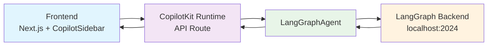

# CopilotKit + LangGraph + Next.js 集成

快速集成 CopilotKit 和 LangGraph，构建 AI 原生应用。

## 🏗️ 架构



**数据流**: `Frontend → CopilotKit Runtime → LangGraph → LangGraph Backend`

**关键组件**:
- **CopilotSidebar**: 聊天界面组件
- **CopilotKit Runtime**: 中间层，处理 API 请求
- **LangGraphAgent**: 连接 LangGraph 服务的桥梁
- **LangGraph Backend**: 你的 AI 代理服务

## 🚀 Quick Start

### 前置条件
- Node.js 18+
- pnpm
- LangGraph 服务运行在 `http://localhost:2024`

**⚠️ 重要提示**：
- LangGraph 服务默认端口是 **2024**，但如果使用 `langgraph up` 启动，端口可能不同
- Agent 名称必须与 `langgraph.json` 中的 `graphs` 字段对应
- 每个 graph ID 会自动创建一个默认 assistant

### 1. 创建项目

```bash
npx create-next-app@latest my-copilot-app
cd my-copilot-app
```

### 2. 安装依赖

```bash
pnpm add @copilotkit/react-ui @copilotkit/react-core @copilotkit/runtime openai@^4.85.1 zod@^3.23.8
```

### 3. 配置环境变量

```env
# 注意：纯 LangGraph 模式下，可以使用假 API key
OPENAI_API_KEY=sk-1234567890abcdef
LANGGRAPH_DEPLOYMENT_URL=http://localhost:2024
# ⚠️ 如果使用 langgraph up 启动，请确认实际端口并修改
# 例如：LANGGRAPH_DEPLOYMENT_URL=http://localhost:8124
```

### 4. 创建 API 路由

`app/api/copilotkit/route.ts`:

```typescript
import {
  CopilotRuntime,
  OpenAIAdapter,
  copilotRuntimeNextJSAppRouterEndpoint
} from "@copilotkit/runtime";
import { LangGraphAgent } from "@copilotkit/runtime/langgraph";
import OpenAI from "openai";
import { NextRequest } from "next/server";

const openai = new OpenAI({ apiKey: process.env.OPENAI_API_KEY });
const serviceAdapter = new OpenAIAdapter({ openai } as any);

const runtime = new CopilotRuntime({
  agents: {
    'default': new LangGraphAgent({
      deploymentUrl: process.env.LANGGRAPH_DEPLOYMENT_URL || "http://localhost:2024",
      graphId: 'agent', // ⚠️ 必须与 langgraph.json 中的 graphs 字段对应
    })
  },
});

export const POST = async (req: NextRequest) => {
  const { handleRequest } = copilotRuntimeNextJSAppRouterEndpoint({
    runtime,
    serviceAdapter,
    endpoint: "/api/copilotkit",
  });

  return handleRequest(req);
};
```

**📋 配置说明**：
- `graphId: 'agent'` 必须与你的 `langgraph.json` 中的 graph ID 完全匹配
- 例如，如果你的 `langgraph.json` 如下：
  ```json
  {
    "graphs": {
      "customer_support": "./src/agent.py:graph",
      "sales_bot": "./src/sales.py:graph"
    }
  }
  ```
  那么你应该使用对应的 graph ID（如 `"customer_support"` 或 `"sales_bot"`）

### 5. 配置布局

`app/layout.tsx`:

```tsx
import { CopilotKit } from "@copilotkit/react-core";
import "@copilotkit/react-ui/styles.css";

export default function RootLayout({
  children,
}: {
  children: React.ReactNode;
}) {
  return (
    <html lang="en">
      <body>
        <CopilotKit runtimeUrl="/api/copilotkit" showDevConsole={false}>
          {children}
        </CopilotKit>
      </body>
    </html>
  );
}
```

### 6. 添加聊天界面

`app/page.tsx`:

```tsx
import { CopilotSidebar } from "@copilotkit/react-ui";

export default function Home() {
  return (
    <main>
      <h1>My AI App</h1>
      <p>Powered by CopilotKit + LangGraph</p>
      <CopilotSidebar />
    </main>
  );
}
```

### 7. 启动应用

```bash
pnpm dev
```

访问 `http://localhost:3000`，点击 "Open Chat" 开始对话！

### 8. 验证集成

```bash
# 测试 API
curl -X POST http://localhost:3000/api/copilotkit \
  -H "Content-Type: application/json" \
  -d '{"method":"info","params":{}}'
```

## ❓ FAQ

### Q: 为什么需要 OpenAI API key？

**A**: 纯 LangGraph 模式下不需要真实的 OpenAI API key！CopilotKit 框架强制要求一个 `ServiceAdapter`，但 `LangGraphAgent` 独立工作。使用假 key（如 `sk-1234567890abcdef`即可。

### Q: 什么时候需要真实的 OpenAI API key？

**A**: 只有在以下情况需要：
- 直接使用 OpenAI 模型（不通过 LangGraph）
- LangGraph 内部配置调用 OpenAI API
- 需要容错机制（LangGraph 失败时 fallback 到 OpenAI）

### Q: 如何解决 MetaMask 连接错误？

**A**: 在 `CopilotKit` 组件中添加 `showDevConsole={false}`：

```tsx
<CopilotKit runtimeUrl="/api/copilotkit" showDevConsole={false}>
  {children}
</CopilotKit>
```

### Q: Agent ID 不匹配错误？

**A**: 确保 API 路由中的 graph ID 与 `langgraph.json` 中的定义一致：

```typescript
const runtime = new CopilotRuntime({
  agents: {
    'default': new LangGraphAgent({
      ...
      graphId: 'agent', // 必须与 langgraph.json 中的 graphs 字段对应
    })
  },
});
```

**常见错误**：
- 使用了错误的 graph ID（如使用了文件名而不是定义的 ID）
- `langgraph.json` 中定义了多个 graph，但使用了不存在的 ID
- 端口配置错误（特别是使用 `langgraph up` 时）

### Q: TypeScript 错误：LangGraphAgent 类型不匹配？

**A**: 确保从正确路径导入：

```typescript
import { LangGraphAgent } from "@copilotkit/runtime/langgraph"; // ✅ 正确
// 而不是
import { LangGraphAgent } from "@copilotkit/runtime"; // ❌ 错误
```

### Q: 如何解决 peer dependency 警告？

**A**: 使用兼容的 OpenAI 版本：

```bash
pnpm add openai@^4.85.1
```

### Q: 如何确认 LangGraph 服务的端口？

**A**: 根据启动方式确认端口：

1. **使用 `langgraph dev`（开发模式）**：
   ```bash
   # 默认端口 2024
   langgraph dev
   # 或指定端口
   langgraph dev --port 3000
   ```

2. **使用 `langgraph up`（生产模式）**：
   ```bash
   langgraph up  # 可能使用不同端口，查看输出信息
   ```

3. **检查服务状态**：
   ```bash
   # 查看端口占用
   netstat -an | grep :2024  # macOS/Linux
   netstat -ano | findstr :2024  # Windows

   # 测试 API
   curl http://localhost:2024/docs
   ```

### Q: langgraph.json 中有多个 graph 怎么办？

**A**: 每个 graph ID 都会创建独立的 assistant：

```json
{
  "graphs": {
    "customer_support": "./src/support.py:graph",
    "sales_assistant": "./src/sales.py:graph",
    "tech_helper": "./src/tech.py:graph"
  }
}
```

使用时指定对应的 graph ID：
```typescript
new LangGraphAgent({
  deploymentUrl: "http://localhost:2024",
  graphId: 'customer_support', // 或 'sales_assistant' 或 'tech_helper'
})
```

### Q: 网络下载太慢怎么办？

**A**: 切换到国内镜像源：

```bash
pnpm config set registry https://registry.npmmirror.com
```

## 📚 相关资源

- [CopilotKit 文档](https://docs.copilotkit.ai)
- [LangGraph 文档](https://langchain-ai.github.io/langgraph/)
- [Next.js 文档](https://nextjs.org/docs)